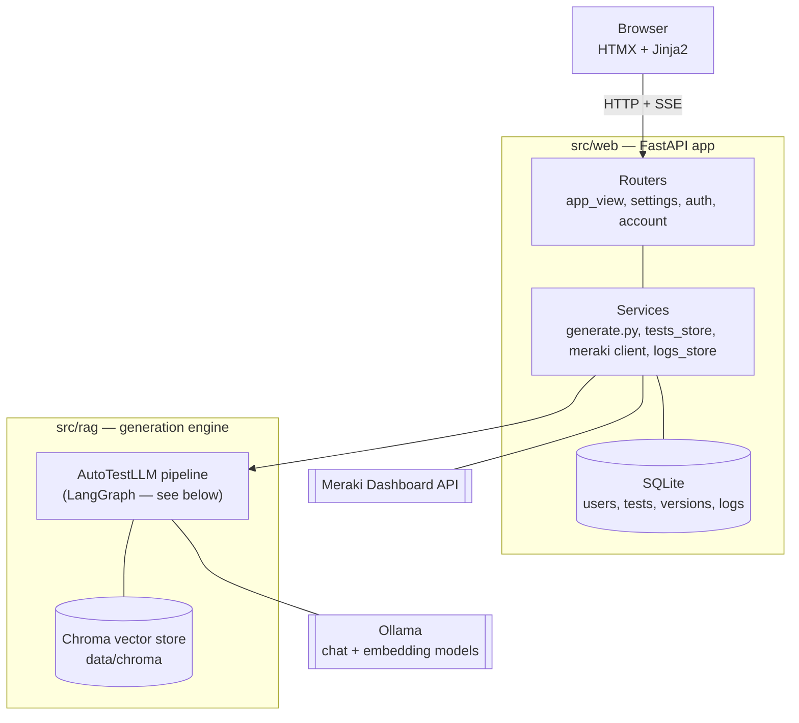
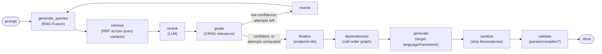

# casewright

casewright turns application and feature specifications into working test code. Describe
what you want tested — an endpoint, a feature, an edge case — and it retrieves the right
context from your API spec, then writes runnable tests against it.

It is not a boilerplate generator. Under the hood it's a hybrid agentic RAG pipeline: a
request goes in, gets decomposed and grounded against the ingested spec corpus, and comes
back out as reviewable test code in the language and framework you asked for.

> **casewright is a placeholder name.** The product is early-stage — the MVP focuses on
> spec-grounded test generation; execution, integrations, and dashboards are being built
> out from here.

Generated code is treated as **untrusted output**: every test is meant for human review,
and — once execution lands — for running in a sandbox, not silently in a developer or CI
workflow. See [Prompt injection in generated code](#prompt-injection-in-generated-code)
below.

## Usage

### Prerequisites

- Python 3.10+
- [Ollama](https://ollama.com) running locally (or reachable) with a chat model and an
  embedding model pulled — casewright talks to it for both retrieval and generation.

### Setup

```bash
git clone <this-repo>
cd autotest

python -m venv .venv
source .venv/bin/activate
pip install -e ".[dev]"
```

No configuration is required for development — every setting has a working default,
and the model provider, vector store, and Meraki integration are all configured from the
**Settings** page at runtime rather than from a config file.

For development, the only thing worth setting is:

```bash
export CASEWRIGHT_DEV=1   # skip the production secret check, use dev-only defaults
```

In production, two secrets are required (they're bootstrap config — the app needs them
before it can read its own database, so they can't live in Settings):

```bash
export JWT_SECRET=<a real secret>          # signs session cookies
export CASEWRIGHT_ENC_KEY=<a Fernet key>   # encrypts the stored Meraki API key at rest
```

See [.env.example](.env.example) for the full list of optional overrides.

### Build the knowledge base

Go to **Settings → Knowledge base**, add an API spec (paste a URL or upload the file),
pick a split method, and start the embedding. Each run becomes a new, selectable version,
so you can switch which corpus generation retrieves against. The store lives inside the
app by default, or you can point it at a remote Chroma server.

There's also a CLI path that ingests the pinned Meraki spec snapshot:

```bash
python -m rag.ingest.split    # split the spec into per-endpoint docs
python -m rag.ingest.embed    # embed those docs into the local Chroma store
```

### Run it

```bash
uvicorn web.main:app --reload
```

Visit `http://localhost:8000`, sign up, and:

1. Connect a Meraki organization in **Settings → Meraki integration** (org ID, verified
   against the Meraki Dashboard API) so its networks and devices become available to
   reference in a prompt with `@device-name`.
2. Describe a test on the composer screen and pick a target language (Python/pytest,
   TypeScript/Jest, Java/JUnit 5, Go, or C#/xUnit).
3. Review the generated code in the workspace — Prompt, Code, and Output tabs — export it
   (copy or download), or refine the prompt and regenerate a new version. Every test keeps
   its full version history.

## How It Works

### Architecture



The web layer never talks to Ollama or Chroma directly — every prompt goes through
`rag.pipeline.AutoTestLLM`, which owns the model and vector-store clients. The web
layer's own services handle persistence (SQLite), the Meraki proxy, and per-user
logs.

### The generation pipeline

Each prompt runs through a LangGraph with a correction loop: if the grader isn't
confident in what it kept, the query gets rewritten and re-retrieved (bounded, so it
can't loop forever) before generation ever runs.



Retrieval nodes degrade gracefully on a bad model response (e.g. fall back to the
unranked pool) but never on a genuine backend outage — that surfaces as an error rather
than a silent empty result, so a down model backend never looks like "nothing found."

## What You Get

- A **composer → workspace** flow: describe a test, watch it stream in, review the result.
- A per-user **test library** with full version history — regenerate a test and its prior
  prompt/code stay reachable, not overwritten.
- **Five target languages**: Python (pytest), TypeScript (Jest), Java (JUnit 5), Go
  (`testing`), and C# (xUnit) — each with its own generation and sanitization rules.
- **Meraki integration**: connect organizations, verify networks, and reference real
  devices in a prompt via `@device-name` mentions.
- **Export**: copy generated code to the clipboard or download it as a file.
- A **Knowledge base** you build from the UI: add an API spec by URL or upload, chunk it
  per-endpoint or with generic recursive splitting, and switch between embedded versions.
  Stored inside the app, or in a remote Chroma server.
- A **Settings** area covering account, Meraki integration, output language, model
  provider (Ollama endpoint/models/temperature/reasoning), the knowledge base, and logs
  (app-wide + per-test generation stages and errors) — no config file needed.
- Placeholder **Runs** and **Coverage** dashboards, ready for real data as those land.

## Repository Map

| Path | Purpose |
| --- | --- |
| `src/web/` | FastAPI app: routers, Jinja2 templates, static assets, auth, per-user services |
| `src/rag/` | The generation pipeline — `pipeline.py` (the LangGraph), `graph/` (prompts, language registry, sanitize, validate, dependency graph), `provider.py` (model/vector-store wiring), `ingest/` (spec split + embed) |
| `src/eval/` | Evaluation harness for the retrieval/generation pipeline (promptfoo, graph-based, and sampling evals) |
| `data/` | The spec corpus and local Chroma vector store |
| `fixtures/` | Fixed inputs used by tests and evals |
| `tests/` | Unit tests for the web layer and the pipeline |
| `docs/` | Frontend/UX build handoff and design mockups |

## Prompt injection in generated code

Generated test code may be influenced by untrusted specification text — summaries or
descriptions pulled from the retrieved corpus. A compromised or poisoned source could
attempt to steer the model into producing harmful or unexpected test code, such as shell
commands or other side effects. Treat generated code as untrusted output that requires
human review before execution, and, once execution lands, run it in a sandbox rather than
directly in a developer or CI workflow.

## Status

Early development. Spec-grounded test generation is the current focus; test execution,
Jira/feature-tracking integration, and richer dashboards are on the roadmap next.
