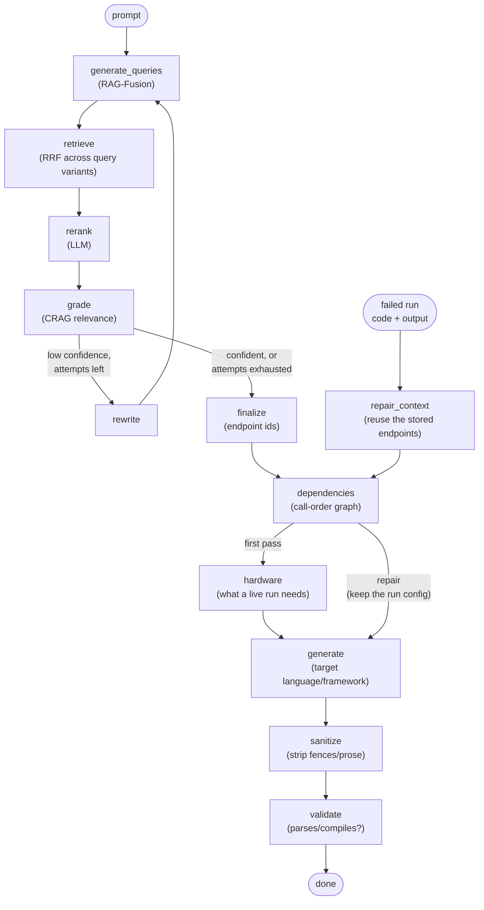

# casewright

casewright turns application and feature specifications into working test code. Describe
what you want tested — an endpoint, a feature, an edge case — and it retrieves the right
context from your API spec, then writes runnable tests against it.

It is not a boilerplate generator. Under the hood it's a hybrid agentic RAG pipeline: a
request goes in, gets decomposed and grounded against the ingested spec corpus, and comes
back out as reviewable test code in the language and framework you asked for.

casewright is a **terminal application** (a Textual TUI). It runs locally as a single-user
tool — no server, no sign-up — and the whole app is driven from one command bar: type a
test description to generate, or a `/command` to navigate and act.

> **casewright is a placeholder name.** The product is early-stage — spec-grounded test
> generation and execution are in; integrations and dashboards are being built out from
> here.

Generated code is treated as **untrusted output**: every test is meant for human review,
and it executes in a short-lived, resource-capped container rather than silently in a
developer or CI workflow. See
[Prompt injection in generated code](#prompt-injection-in-generated-code) below.

## Usage

### Prerequisites

- Python 3.10+
- [Ollama](https://ollama.com) running locally (or reachable) with a chat model and an
  embedding model pulled — casewright talks to it for both retrieval and generation.
- Docker, to run generated tests. Only needed for execution; generation works without it.

### Setup

```bash
git clone <this-repo>
cd autotest

python -m venv .venv
source .venv/bin/activate
pip install -e ".[dev]"
```

No configuration is required for development — every setting has a working default, and
the model provider, vector store, and Meraki integration are all configured at runtime
from the `/settings` screen rather than from a config file.

For development, the only thing worth setting is:

```bash
export CASEWRIGHT_DEV=1   # skip the production secret check, use dev-only defaults
```

In production, one secret is required. It's bootstrap config — the app needs it before it
can read its own database, so it can't live in Settings. In dev it's generated for you and
persisted to `~/.config/casewright/`; production must supply it explicitly, so it can come
from a real secret store and so a redeployed instance doesn't invent a new key and lose
access to already-encrypted data:

```bash
# encrypts the stored Meraki API key at rest
export CASEWRIGHT_ENC_KEY=$(python -c "from cryptography.fernet import Fernet; print(Fernet.generate_key().decode())")
export CASEWRIGHT_DEV=0
```

See [.env.example](.env.example) for the full list of optional overrides (database path,
spec directory, Meraki base URL, and the Ollama/Chroma host allowlist).

### Run it

```bash
casewright        # installed console script
# or, equivalently:
python -m tui
```

That launches the terminal app. It resolves a single local user on first run (there is no
login) and drops you at the command bar.

### The command bar

Everything happens through the text box at the bottom of the screen.

- **Plain text is a test description.** Type what you want tested and press Enter — it
  generates, streaming the result into the transcript above.
- **`/` starts a command.** Commands navigate between places and act on the current test.
  Start typing one and a menu of matches appears above the box: **↑/↓** move the highlight,
  **Tab** completes it, **Enter** runs it (even half-typed — `/h`↵ runs `/help`), **Esc**
  closes the menu.

| | Command | Does |
| --- | --- | --- |
| **Go** | `/tests` | list every test |
| | `/new` | start a new test |
| | `/prompt` | the current test's prompt |
| | `/code` | the current test's generated code |
| | `/config` | the run configuration (network + hardware) |
| | `/output` | the current test's latest run output |
| | `/runs` | run history across all tests |
| | `/coverage` | spec-coverage tree |
| | `/kb` | knowledge base |
| | `/settings` | app settings |
| **Do** | `/generate` | (re)generate from the current prompt |
| | `/run` | run the current test |
| | `/repair` | send a failed run back through the pipeline |
| | `/export` | copy the code to the clipboard |
| | `/open <name or #>` | load a test from the library |
| | `/version next \| prev` | step through a test's versions |
| **App** | `/help` | show the full command list |
| | `/back` | return to the workspace |
| | `/quit` | exit (also `Ctrl+Q`) |

`/settings`, `/kb`, `/coverage`, and `/runs` open their own screens; the command bar comes
with you, so you can jump anywhere from anywhere.

### A first test

1. **`/settings`** — connect a Meraki organization (org ID, verified against the Meraki
   Dashboard API) and set your model provider (Ollama endpoint + chat/embedding models).
   An org's **unclaimed inventory** becomes referenceable in a prompt with `@device-name` —
   that's the pool a run claims from. Runs that clone an example network also need a
   **default example network** picked here.
2. **`/kb`** — build a knowledge base from an API spec (see below), so generation has
   something to ground against.
3. **Describe a test** at the command bar and press Enter. It streams into the transcript;
   when it's done, `/code` shows the file and `/config` shows how a run is set up.
4. **`/run`** — each run provisions its own ephemeral Meraki network, claims exactly the
   hardware the test names, executes the code in a container, and tears it all back down.
   The run streams into the transcript; `/output` re-shows the latest.
5. **`/repair`** — if a run fails, this sends the code and the failure back through the
   pipeline as a new version. Every test keeps its full version history (`/version`).

### Build the knowledge base

Open **`/kb`**, add an API spec (paste a URL or give a local file path), pick a split
method, and start the embedding. Each run becomes a new, selectable version, so you can
switch which corpus generation retrieves against (`/activate <#>`). The store lives inside
the app by default, or you can point it at a remote Chroma server.

There's also a CLI path that ingests the pinned Meraki spec snapshot:

```bash
python -m rag.ingest.split    # split the spec into per-endpoint docs
python -m rag.ingest.embed    # embed those docs into the local Chroma store
```

Note that the CLI writes to the default collection (`meraki_openapi`) and does **not**
register a knowledge-base version, so what it ingests won't appear under `/kb` and can't be
named or selected there — the two paths don't know about each other. Build from the UI if
you want a version you can manage.

### Reaching a non-local Ollama

casewright only dials allow-listed hosts for the Ollama URL and a remote Chroma URL (an
SSRF guard). `localhost` works out of the box; to point at Ollama or Chroma on another
host, add it to the allowlist:

```bash
export AUTOTEST_OLLAMA_ALLOWED_HOSTS=gpu-box:11434
```

## How It Works

### Architecture

casewright is a Textual TUI (`src/tui/`) over a services core (`src/web/`) and the
generation pipeline (`src/rag/`). The TUI never talks to Ollama or Chroma directly — every
prompt goes through `rag.pipeline.AutoTestLLM`, which owns the model and vector-store
clients. The services layer handles persistence (SQLite), the Meraki proxy, the run
subsystem, and per-user logs; the TUI subscribes to the same background-job registries the
services expose and renders their event streams into the transcript.

> `src/web/` is a historical name — it was a FastAPI web app before the TUI replaced the
> front end. It's now a headless services/persistence layer with no server or templates.

### The generation pipeline

Each prompt runs through a LangGraph with a correction loop: if the grader isn't
confident in what it kept, the query gets rewritten and re-retrieved (bounded, so it
can't loop forever) before generation ever runs.

The graph has **two entry points**. A prompt takes the long way round — retrieve, rank,
grade, decide the hardware, then write the test. A **repair** (a failed run sent back
with its output) skips retrieval entirely and re-enters at `repair_context`, reusing the
endpoints the first pass already grounded on, then rejoins the shared tail.



Retrieval nodes degrade gracefully on a bad model response (e.g. fall back to the
unranked pool) but never on a genuine backend outage — that surfaces as an error rather
than a silent empty result, so a down model backend never looks like "nothing found."

### Repairing a failed test

A run keeps everything: the prompt, the endpoints it was grounded in, the code, and the
container's own output. **`/repair`** hands the model all four and asks it to correct the
test. The fix lands as a new version, so the previous code stays reachable if it turns out
worse.

Two deliberate limits. Retrieval is skipped, so a repair can't quietly drift onto a
different set of endpoints than the test was written for. And the `hardware` node is
skipped too — a code fix has no business re-deciding which devices a run claims, so the
pinned hardware carries over untouched.

A run can fail two ways, and the repair prompt is told which: the test ran and failed
(fixable), or the run never reached the test — Docker down, hardware not claimable — in
which case the code may be fine. The model is explicitly licensed to return it unchanged
rather than invent an edit for a problem that isn't in the code.

## What You Get

- A **command-bar workflow**: describe a test, watch it stream into the transcript, then
  drive everything — code, config, run, repair — with slash commands.
- A per-user **test library** with full version history — regenerate a test and its prior
  prompt/code stay reachable, not overwritten (`/tests`, `/open`, `/version`).
- **Five target languages**: Python (pytest), TypeScript (Jest), Java (JUnit 5), Go
  (`testing`), and C# (xUnit) — each with its own generation and sanitization rules.
- **Meraki integration**: connect organizations (and disconnect them — locally; nothing is
  deleted in Meraki), auto-list their networks, and reference real claimable hardware in a
  prompt via `@device-name` mentions.
- **Export**: copy generated code to the clipboard (`/export`).
- A **knowledge base** you build from `/kb`: add an API spec by URL or file path, chunk it
  per-endpoint or with generic recursive splitting, and switch between embedded versions.
  Stored inside the app, or in a remote Chroma server.
- **Test execution** (`/run`): run a generated test in a short-lived Docker container
  against its own ephemeral Meraki network — cloned from an example or built from scratch by
  an agent — with its hardware claimed from your org's unclaimed inventory and released
  afterwards. A device the test names by serial is claimed exactly, never substituted for
  another of the same type; hardware is never fabricated either, so if the org has nothing
  suitable the run errors rather than pretending. The run streams into the transcript:
  provisioning, the container's own stdout, then teardown. Python, Go, and generic scripts
  run today; TypeScript, Java, and C# generate but report a clear "no runner yet" error.
- **Repair** (`/repair`): send a failed run's code and output back through the pipeline as a
  new version — see [Repairing a failed test](#repairing-a-failed-test). Needs a run to
  learn from, so it's offered only after one fails.
- **Settings** (`/settings`) covering Meraki integration, the model provider (Ollama
  endpoint/models/temperature/reasoning), run containers (per-language base images, timeout,
  CPU/memory caps, cleanup policy), and logs — no config file needed.
- Placeholder **Runs** (`/runs`) and **Coverage** (`/coverage`) screens. Runs shows real
  history; Coverage overlays your tests on the pinned spec.

## Repository Map

| Path | Purpose |
| --- | --- |
| `src/tui/` | The Textual terminal app: the command bar and its vocabulary (`commands.py`), the shared command-driven base screen (`command_screen.py`), the workspace transcript and the Settings/Knowledge base/Coverage/Runs screens (`screens/`), plus the generation/run/streaming glue |
| `src/web/` | Headless services + persistence layer (historical name): SQLite (`db.py`), config, and per-user services (Meraki proxy, stores, and the run subsystem — `services/run_orchestrator.py`, `services/network_provision.py`, `services/runners/`) |
| `src/rag/` | The generation pipeline — `pipeline.py` (the LangGraph), `graph/` (prompts, language registry, sanitize, validate, dependency graph), `provider.py` (model/vector-store wiring), `ingest/` (spec split + embed) |
| `src/eval/` | Evaluation harness for the retrieval/generation pipeline (promptfoo, graph-based, and sampling evals) |
| `data/` | The spec corpus and local Chroma vector store |
| `fixtures/` | Fixed inputs used by tests and evals |
| `tests/` | Unit tests for the services layer, the pipeline, and the TUI |

## Prompt injection in generated code

Generated test code may be influenced by untrusted specification text — summaries or
descriptions pulled from the retrieved corpus. A compromised or poisoned source could
attempt to steer the model into producing harmful or unexpected test code, such as shell
commands or other side effects. Treat generated code as untrusted output that requires
human review before execution.

Runs execute in a short-lived container with a timeout and CPU/memory caps
(**`/settings` → Run containers**), which contains the blast radius but is not a security
boundary — the container reaches your Meraki org, so review code before running it.

## Status

Early development. Spec-grounded test generation and container-backed execution are in.
Python, Go, and script runners work; TypeScript, Java, and C# still need runners. Remaining
target-language runners and Jira/feature-tracking integration are next.
