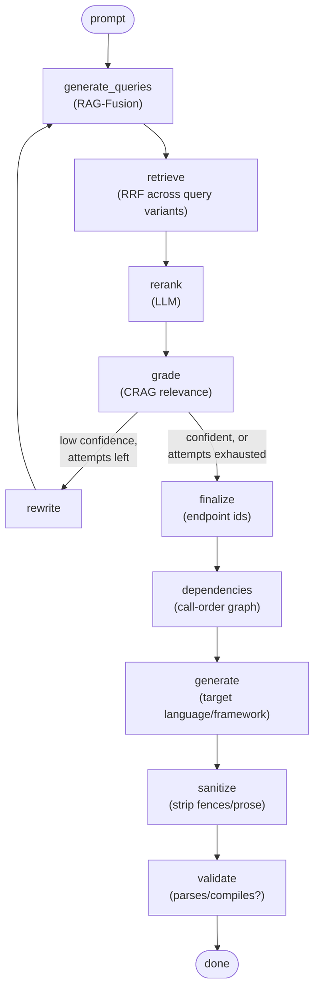

# casewright

casewright turns application and feature specifications into working test code. Describe
what you want tested — an endpoint, a feature, an edge case — and it retrieves the right
context from your API spec, then writes runnable tests against it.

It is not a boilerplate generator. Under the hood it's a hybrid agentic RAG pipeline: a
request goes in, gets decomposed and grounded against the ingested spec corpus, and comes
back out as reviewable test code in the language and framework you asked for.

> **casewright is a placeholder name.** The product is early-stage — spec-grounded test
> generation and execution are in; integrations and dashboards are being built out from
> here.

Generated code is treated as **untrusted output**: every test is meant for human review,
and it executes in a short-lived, resource-capped container rather than silently in a
developer or CI workflow. See
[Prompt injection in generated code](#prompt-injection-in-generated-code) below.

## Usage

### Prerequisites

- Python 3.10+
- [Ollama](https://ollama.com) running locally (or reachable) with a chat model and an
  embedding model pulled — casewright talks to it for both retrieval and generation.
- Docker, to run generated tests. Only needed for execution; generation works without it.

### Setup

```bash
git clone <this-repo>
cd autotest

python -m venv .venv
source .venv/bin/activate
pip install -e ".[dev]"
```

No configuration is required for development — every setting has a working default,
and the model provider, vector store, and Meraki integration are all configured from the
**Settings** page at runtime rather than from a config file.

For development, the only thing worth setting is:

```bash
export CASEWRIGHT_DEV=1   # skip the production secret check, use dev-only defaults
```

In production, two secrets are required. They're bootstrap config — the app needs them
before it can read its own database, so they can't live in Settings. In dev they're
generated for you and persisted to `~/.config/casewright/`; production must supply them
explicitly, so they can come from a real secret store and so a redeployed container
doesn't invent a new signing key and log everyone out:

```bash
# signs session cookies
export JWT_SECRET=$(python -c "import secrets; print(secrets.token_urlsafe(32))")
# encrypts the stored Meraki API key at rest
export CASEWRIGHT_ENC_KEY=$(python -c "from cryptography.fernet import Fernet; print(Fernet.generate_key().decode())")
export CASEWRIGHT_DEV=0
```

See [.env.example](.env.example) for the full list of optional overrides.

### Build the knowledge base

Go to **Settings → Knowledge base**, add an API spec (paste a URL or upload the file),
pick a split method, and start the embedding. Each run becomes a new, selectable version,
so you can switch which corpus generation retrieves against. The store lives inside the
app by default, or you can point it at a remote Chroma server.

There's also a CLI path that ingests the pinned Meraki spec snapshot:

```bash
python -m rag.ingest.split    # split the spec into per-endpoint docs
python -m rag.ingest.embed    # embed those docs into the local Chroma store
```

Note that the CLI writes to the default collection (`meraki_openapi`) and does **not**
register a knowledge-base version, so what it ingests won't appear in Settings and can't
be named or selected there — the two paths don't know about each other. Build from the UI
if you want a version you can manage.

### Run it with Docker

```bash
docker compose up --build     # -> http://localhost:8000
```

Everything else is configured from the Settings page once it's running. Two notes:

- **Reaching Ollama.** Inside a container `localhost` is the container itself, and the
  app only dials allow-listed hosts (an SSRF guard that covers both the Ollama URL and
  a remote Chroma URL). Compose defaults the allowlist to `host.docker.internal:11434`
  — Ollama on your machine. For Ollama elsewhere, list that host too:

  ```bash
  AUTOTEST_OLLAMA_ALLOWED_HOSTS=gpu-box:11434 docker compose up --build
  ```

- **Secrets.** Compose runs in dev mode by default so it starts with no setup. For
  anything real, set `JWT_SECRET` and `CASEWRIGHT_ENC_KEY` and `CASEWRIGHT_DEV=0`.

The SQLite database and the local vector store are named volumes, so users, tests, and
embedded knowledge-base versions survive a rebuild. They start **empty** and are separate
from whatever you have locally — the container won't see the database in
`~/.config/casewright/` or the vectors in `./data/chroma`, so expect to sign up and embed
again. Bind-mount those paths instead if you want to carry existing data in.

To run Chroma as its own service instead of storing vectors in the app container:

```bash
docker compose --profile remote-chroma up --build
```

then add `chroma:8000` to the allowlist and point **Settings → Knowledge base → Remote**
at `http://chroma:8000`.

### Run it locally

```bash
uvicorn web.main:app --reload
```

Visit `http://localhost:8000`, sign up, and:

1. Connect a Meraki organization in **Settings → Meraki integration** (org ID, verified
   against the Meraki Dashboard API) so its networks and devices become available to
   reference in a prompt with `@device-name`. Runs that clone an example network also
   need a **default example network** picked here.
2. Describe a test on the composer screen and pick a target language (Python/pytest,
   TypeScript/Jest, Java/JUnit 5, Go, or C#/xUnit).
3. Review the generated code in the workspace — Prompt, Code, and Output tabs — export it
   (copy or download), or refine the prompt and regenerate a new version. Every test keeps
   its full version history.
4. **Run it** from the workspace: pick the hardware the test needs and whether to clone
   your example network or build one from scratch, and watch the stages stream in. Each
   run provisions its own ephemeral Meraki network, claims the hardware, executes the
   code in a container, and tears it all back down.

## How It Works

### Architecture


The web layer never talks to Ollama or Chroma directly — every prompt goes through
`rag.pipeline.AutoTestLLM`, which owns the model and vector-store clients. The web
layer's own services handle persistence (SQLite), the Meraki proxy, and per-user
logs.

### The generation pipeline

Each prompt runs through a LangGraph with a correction loop: if the grader isn't
confident in what it kept, the query gets rewritten and re-retrieved (bounded, so it
can't loop forever) before generation ever runs.



Retrieval nodes degrade gracefully on a bad model response (e.g. fall back to the
unranked pool) but never on a genuine backend outage — that surfaces as an error rather
than a silent empty result, so a down model backend never looks like "nothing found."

## What You Get

- A **composer → workspace** flow: describe a test, watch it stream in, review the result.
- A per-user **test library** with full version history — regenerate a test and its prior
  prompt/code stay reachable, not overwritten.
- **Five target languages**: Python (pytest), TypeScript (Jest), Java (JUnit 5), Go
  (`testing`), and C# (xUnit) — each with its own generation and sanitization rules.
- **Meraki integration**: connect organizations, verify networks, and reference real
  devices in a prompt via `@device-name` mentions.
- **Export**: copy generated code to the clipboard or download it as a file.
- A **Knowledge base** you build from the UI: add an API spec by URL or upload, chunk it
  per-endpoint or with generic recursive splitting, and switch between embedded versions.
  Stored inside the app, or in a remote Chroma server.
- **Test execution**: run a generated test in a short-lived Docker container against its
  own ephemeral Meraki network — cloned from an example or built from scratch by an agent
  — with the required hardware claimed from your org's unclaimed inventory and released
  afterwards. Hardware is never fabricated: if the org has nothing suitable, the run
  errors rather than pretending. Python, Go, and generic scripts run today; TypeScript,
  Java, and C# generate but report a clear "no runner yet" error.
- A **Settings** area covering account, Meraki integration, output language, model
  provider (Ollama endpoint/models/temperature/reasoning), the knowledge base, run
  containers (per-language base images, timeout, CPU/memory caps, cleanup policy), and
  logs (app-wide + per-test generation stages and errors) — no config file needed.
- Placeholder **Runs** and **Coverage** dashboards. Execution is driven from a test's
  workspace; these pages don't show real data yet.

## Repository Map

| Path | Purpose |
| --- | --- |
| `src/web/` | FastAPI app: routers, Jinja2 templates, static assets, auth, per-user services, and the run subsystem (`services/run_orchestrator.py`, `services/network_provision.py`, `services/runners/`) |
| `src/rag/` | The generation pipeline — `pipeline.py` (the LangGraph), `graph/` (prompts, language registry, sanitize, validate, dependency graph), `provider.py` (model/vector-store wiring), `ingest/` (spec split + embed) |
| `src/eval/` | Evaluation harness for the retrieval/generation pipeline (promptfoo, graph-based, and sampling evals) |
| `data/` | The spec corpus and local Chroma vector store |
| `fixtures/` | Fixed inputs used by tests and evals |
| `tests/` | Unit tests for the web layer and the pipeline |
| `docs/` | Frontend/UX build handoff and design mockups |

## Prompt injection in generated code

Generated test code may be influenced by untrusted specification text — summaries or
descriptions pulled from the retrieved corpus. A compromised or poisoned source could
attempt to steer the model into producing harmful or unexpected test code, such as shell
commands or other side effects. Treat generated code as untrusted output that requires
human review before execution.

Runs execute in a short-lived container with a timeout and CPU/memory caps
(**Settings → Run / Containers**), which contains the blast radius but is not a security
boundary — the container reaches your Meraki org, so review code before running it.

## Status

Early development. Spec-grounded test generation and container-backed execution are in.
Python, Go, and script runners work; TypeScript, Java, and C# still need runners. The
Runs and Coverage dashboards, and Jira/feature-tracking integration, are next.
